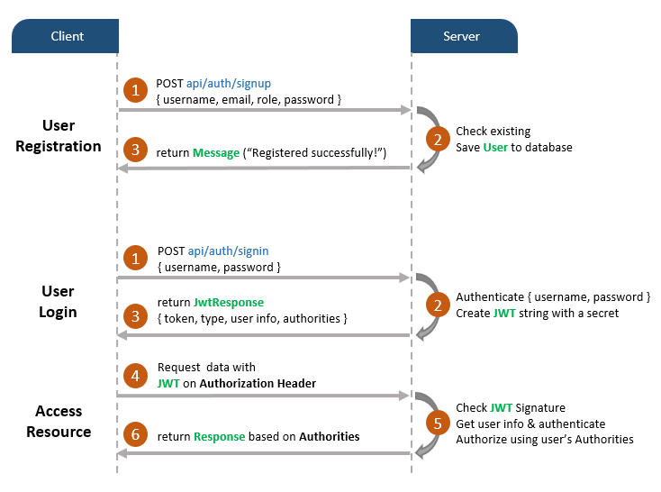
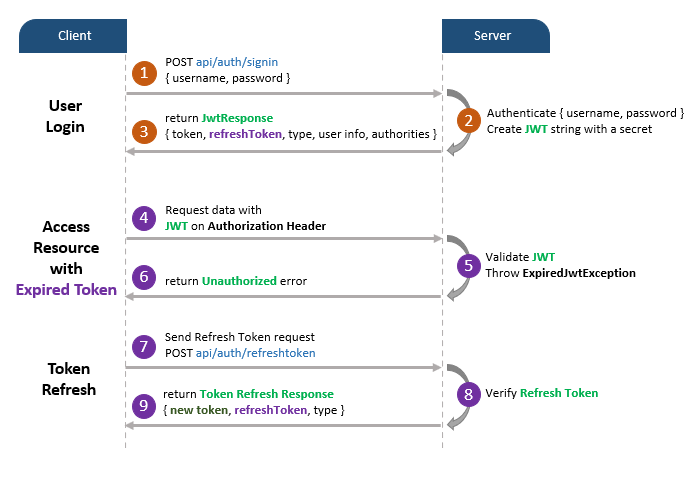

# Spring Boot Refresh Token with JWT example

Build JWT Refresh Token in the Java Spring Boot Application. You can know how to expire the JWT, then renew the Access Token with Refresh Token.

The instruction can be found at:
[Spring Boot Refresh Token with JWT example](https://bezkoder.com/spring-boot-refresh-token-jwt/)

## User Registration, User Login and Authorization process.
The diagram shows flow of how we implement User Registration, User Login and Authorization process.



And this is for Refresh Token:



## Spring Boot Server Architecture with Spring Security
You can have an overview of our Spring Boot Server with the diagram below:


## Configure Spring Datasource, JPA, App properties
Open `src/main/resources/application.properties`

```properties
spring.datasource.url= jdbc:mysql://localhost:3306/testdb?useSSL=false
spring.datasource.username= root
spring.datasource.password= root

spring.jpa.properties.hibernate.dialect= org.hibernate.dialect.MySQL5InnoDBDialect
spring.jpa.hibernate.ddl-auto= update

# App Properties
app.jwtSecret= apiSecret
app.jwtExpirationMs= 3600000
app.jwtRefreshExpirationMs= 86400000
```

## Run Spring Boot application
```
mvn spring-boot:run
```

## Run following SQL insert statements
```
INSERT INTO roles(name) VALUES('ROLE_USER');
INSERT INTO roles(name) VALUES('ROLE_MODERATOR');
INSERT INTO roles(name) VALUES('ROLE_ADMIN');
```
